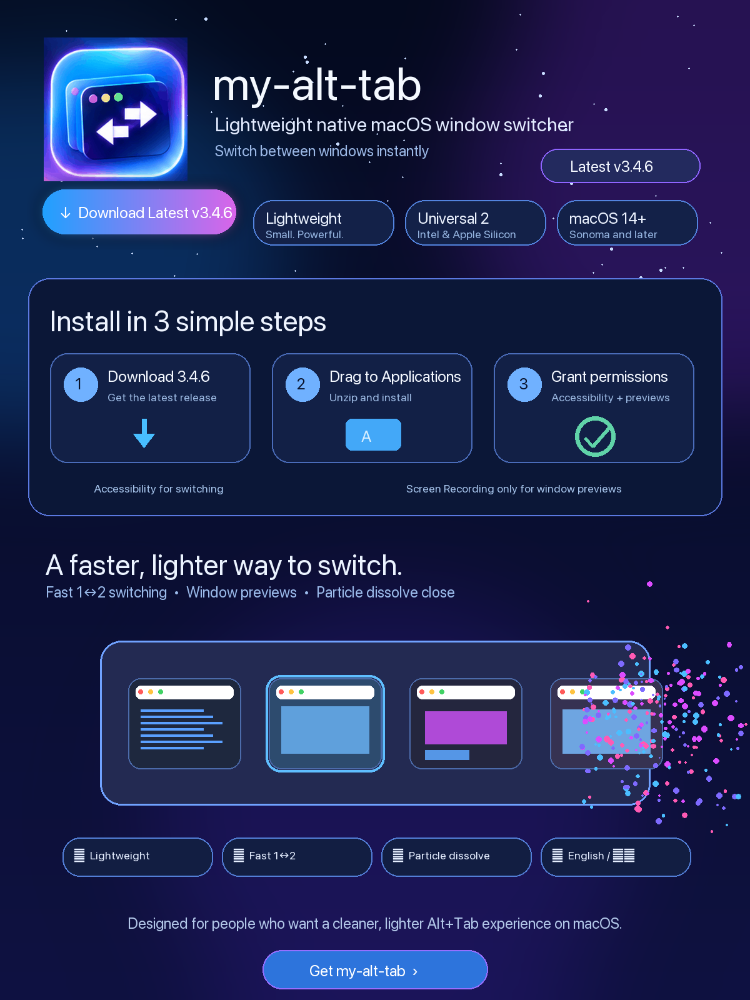
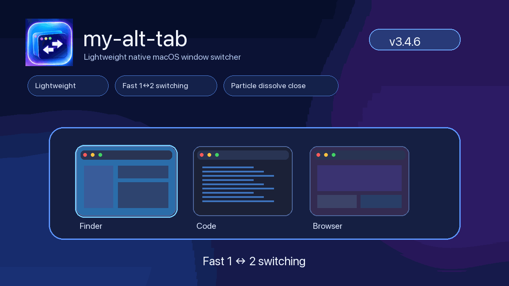

<p align="center">
  <a href="https://github.com/zhangqiaoran/my-alt-tab/releases/latest">
    
  </a>
</p>

<p align="center">
  <a href="https://github.com/zhangqiaoran/my-alt-tab/releases/latest">
    
  </a>
</p>

<p align="center">
  
</p>

<p align="center">
  <strong>Lightweight · Fast 1↔2 switching · Window previews · Particle dissolve close · Clear Glass · English / 中文</strong>
</p>

## Install in 3 simple steps

| 1 · Download | 2 · Install | 3 · Permissions |
| --- | --- | --- |
| Download `my-alt-tab-3.4.7.zip` from **Releases**. | Unzip it and drag **my-alt-tab.app** into **Applications**. | Grant **Accessibility** for switching. Grant **Screen Recording** only for window previews. |

## Why my-alt-tab

| | Feature | What it gives you |
| --- | --- | --- |
| 🪶 | **Lightweight** | Native Swift / AppKit, no always-running animation loop. |
| ⚡ | **Fast 1↔2 switching** | Rapid Alt/Option+Tab toggles stay responsive and deterministic. |
| 📌 | **Pin & search** | Hover the switcher to pin it open or search windows by app/title without releasing it. |
| 🪟 | **Window previews** | Switch to the exact window, not just the application. |
| ✨ | **Particle dissolve close** | Closing a window visually dissolves into particles before the list smoothly reflows. |
| 💎 | **Clear Glass** | Native macOS 26 Clear Glass with fully opaque foreground content. |
| 🌐 | **English / 中文** | Settings can switch language instantly without restarting. |

> **New icon from v3.4.4:** the neon stacked-window icon shown above is now the canonical app icon used by packaged builds.

中文说明：[`README.zh-CN.md`](README.zh-CN.md)

## v3.4.7

- **Outer-panel shake removed:** AX/WindowStore metadata notifications whose stable window-ID order did not change now take a content-only refresh path. They no longer increment the structural reflow generation, relayout the panel, or force-commit the NSWindow while a close animation is still running.
- **Search is now thumbnail-only:** filtering never resizes or recenters the NSWindow, Glass surface, ScrollView viewport, search field, Pin, or ellipsis. Only surviving stable-ID thumbnail layers move inside the already-open panel.
- **Zero-result search fixed:** no matches now keeps the original panel geometry, hides all thumbnail views cleanly, hides the selection lens, and presents a single centered “No matching windows” state instead of collapsing cards into a narrow strip.
- **Backspace / Delete fixed in Search:** clicking the search field pre-arms text-editing mode before the next key event can reach the global switcher map. Backspace and Forward Delete stay with AppKit's field editor instead of becoming the switcher's window-close command.
- **Search field focus stays stable:** filtering no longer moves/resizes the field editor, so typing and deleting do not lose first responder after the first result update.
- **Independent search motion generation:** search-only tile motion no longer cancels or commits a structural close reflow. Structural panel motion and search filtering have separate interruption tokens.
- **Less hot-path work:** unchanged search result sets perform no switcher UI update; same-ID AX refreshes avoid layout entirely; temporary ID arrays and redundant availability work were removed.
- Added regression tests covering fixed outer geometry during search, zero-match layout, Backspace/Forward Delete routing, stable tile reuse, and metadata refreshes arriving during an active structural reflow.
- Retains v3.4.6 Pin/Search, Stable-ID physical view reuse, external-display preview fixes, Clear Glass, particle dissolve, Universal 2, and signed Sparkle updates.

## v3.4.6

- **Pin the switcher:** hover the panel and click the new top-left pin control to convert the current held Alt/Option+Tab session into persistent mode; releasing the modifier no longer dismisses or activates it.
- **Search windows:** a centered search field appears only while hovering the switcher chrome. Search matches app name + window title with case/width/diacritic folding and keeps session/MRU order intact.
- **Clean hover-only chrome:** Pin, Search, and the top-right ellipsis are hidden by default in both cycling and persistent sessions and fade in together only when the pointer enters the switcher. Search remains visible while actively editing.
- **True synchronized reflow:** the real NSWindow stays stationary while Glass, chrome, scroll geometry, surviving thumbnails, focus ring, Pin/Search and controls animate on one layer-backed compositor clock. The final NSWindow frame is committed only after motion completes, eliminating the WindowServer-vs-Core-Animation one-frame skew.
- **Stable physical thumbnail views:** surviving windows keep the same NSView/CALayer by stable ID after earlier cards disappear. B/C/D now move their existing layers forward instead of being rebound into A/B/C pooled views before the animation starts.
- **Scroll geometry is part of FLIP:** clip-view bounds now animate/commit with the document and tiles, removing multi-row list jumps.
- **Low-overhead search path:** normalized app/title strings are built only when the session source list changes; typing normalizes the query once and uses a cache-friendly linear scan with no polling, display link, or background search timer.
- Retains v3.4.5 external-display capture fixes, v3.4.4 rapid 1↔2 input fix, Clear Glass, particle dissolve, bilingual Settings, Universal 2, and Sparkle updates.

## v3.4.5

- **External-display previews fixed:** Window Preview tile geometry now follows the screen where the switcher is actually presented instead of inheriting the primary display's aspect ratio.
- Preview capture sizing now follows the live target display set, including 1x external monitors; the old hard-coded 2x Retina image-size assumption is removed.
- **Smoother list reflow:** when a thumbnail disappears, surviving cards now glide into place with a longer non-bouncy ease-out instead of feeling like an instant jump.
- Reflow animations are now interruption-safe: a newer layout invalidates older animation completions so rapid removals cannot snap the panel or tiles back to stale geometry.
- Keeps v3.4.4's rapid Alt/Option+Tab fix, canonical neon icon, bilingual Settings, Clear Glass, particle dissolve, Universal 2, and Sparkle updates.

## v3.4.4

- **Rapid Alt/Option+Tab 1↔2 switching fixed:** modifier release now ends the tap-side held session synchronously, so an immediate second chord starts a fresh session instead of becoming a stale step that is discarded after the previous session closes.
- A committed target is promoted in MRU order immediately before asynchronous AX focus confirmation, so repeated fast toggles always see the just-activated window as current and the former window as previous.
- The controller no longer rewrites the event tap's held/sticky mode while showing the panel, preventing delayed main-thread work from overwriting a newer physical shortcut sequence.
- Keeps v3.4.3's English/中文 Settings, retired tab-count option, click-through fixes, Clear Liquid Glass, 96-state dissolve, Stable-ID FLIP, Universal 2, and Sparkle updates.

## v3.4.3

- **Rapid Alt/Option+Tab switching fixed:** releasing the modifier now ends the tap-side held session synchronously, so an immediate second chord starts a fresh session instead of becoming a stale step that is later discarded.
- A committed target is promoted in MRU order immediately before asynchronous AX focus confirmation, keeping fast 1↔2 toggles deterministic even when focus notifications lag.
- **Settings now supports English / 中文:** a new Language picker in General switches the entire Settings window live, including toolbar pane names, form labels, buttons, status text, shortcut validation, Updates, and About.
- The selected Settings language is persisted; **Restore Defaults** returns it to English. Switching languages does not require restarting my-alt-tab.
- Removed the low-value **Show tab counts** preference from Appearance and retired the persisted option; tab-count metadata now stays off.
- Simplified the Appearance pane and corrected its Liquid Glass help text to match the current background-only Clear Glass implementation from v3.4.2.
- v3.4.2's click-through fix, Clear Liquid Glass, root pointer routing, 96-state dissolve, Stable-ID FLIP reflow, Universal 2 packaging, and Sparkle verification remain intact.

## v3.4.2

- **Click-through fixed at the window boundary:** the borderless nonactivating `NSPanel` is explicitly mouse-owning and key-capable on deliberate clicks, so a click no longer lands on the real window underneath.
- The root panel now resolves **window cards, Close, Settings, and permission controls** from final host-space geometry before nested view hit-testing can interfere.
- **Liquid Glass is transparent again:** macOS 26+ uses native `NSGlassEffectView.Style.clear`, no white tint, and a background-only Glass layer below ordinary AppKit chrome.
- At 100% the Glass background surface is intentionally thinned to about **48% alpha** with zero milk; lowering the slider restores material strength and adds the separate perceptual milk layer.
- Foreground thumbnails, labels, buttons, selection ring, and hit targets remain fully opaque and are never faded with the Glass.
- The 96-state dissolve mask, immediate real-window close, Stable-ID FLIP reflow, Universal 2 packaging, Reduce Motion, and Sparkle EdDSA update verification remain intact.

## v3.4.0

- **Liquid means liquid:** the glass slider now controls both native material surface strength and an independent milky layer. 100% is the most transparent/liquid state; 0% is the strongest milky state.
- Glass is now a background-only sibling below fully opaque switcher content, so thinning the material never fades thumbnails, labels, controls, or the blue focus ring.
- Window removal uses a single **Stable-ID FLIP** transaction for window, glass, chrome, scroll geometry, surviving tiles, and selection instead of mixing NSWindow animation with independent Core Animation tile motion.
- Selected tiles no longer add a separate 1.018× scale animation during reflow, removing another source of perceived micro-jitter.
- The true thumbnail erosion and 80% dust-first close choreography from 3.3 remain intact.

## v3.3.0

- **Literal Clear Glass:** 100% adds no white density; even 0% adds only a light 20% maximum content-zone density. macOS 26+ remains native `NSGlassEffectView.Style.clear`.
- **True thumbnail dissolve:** the real pooled tile is hidden after snapshot capture, so erosion holes expose glass instead of an unchanged copy underneath.
- A cached **36-frame irregular alpha-mask atlas** physically removes snapshot regions using deterministic fine/coarse noise.
- The GPU dust emitter is now a narrow moving front that follows the disappearing edge instead of spraying uniformly across the whole card.
- The 80% particle-first hand-off and smooth 0.42 s list reflow remain unchanged.

## v3.2.0

- **Transparent top chrome:** empty space above the window row no longer receives a milky white overlay; macOS 26+ keeps that chrome clear while frosting stays localized around content.
- **Blue focus ring:** selected windows keep their original preview pixels and are indicated only by a 2 pt fixed system-blue outline plus a restrained blue glow.
- **80% dust hand-off:** closing a window starts the dense GPU dust erosion immediately, freezes switcher geometry through 80% of the 1.02 s dissolve, then begins the synchronized 0.42 s panel/tile shrink.
- The real AX window still closes immediately; the retained card is only a short-lived visual ghost. Store refresh and activation logic understand that ghost state.
- Universal 2 and signed Sparkle in-app updates remain supported.

## v3.1.0

- Control Center-style **Frosted Glass** replaces the clear-plastic look.
- Window-list shrink now uses one synchronized non-overshooting motion curve instead of mixing AppKit resize timing with a spring.
- Close dissolution uses GPU `CAEmitterLayer` dust, directional erosion, an illuminated dissolve edge, and soft haze for a much denser drifting effect.
- The official release workflow is prepared for stable Developer ID signing + notarization so future signed updates can preserve macOS permissions.

## v3.0.0

- **Fluid list reflow:** when windows disappear from an open switcher, survivors are matched by stable window ID and spring from their current presentation-layer positions while the centered panel shrinks with native AppKit animation.
- **Dusting close engine:** window close now uses a deterministic 56-particle R2 low-discrepancy distribution, gradient erosion, and cubic inward/upward wind paths for a softer drifting disintegration.
- **Interruptible motion:** repeated closes start from the currently rendered Core Animation presentation state instead of stale geometry, avoiding jumps during fast interaction.
- **Proactive Updates:** opening Settings → Updates silently probes the signed Sparkle feed; a new version exposes a prominent **Update Now…** path into Sparkle's verified installer.
- **Zero idle animation cost:** no display link, repeating particle timer, or background motion loop was added. Reduce Motion is respected.
- Removed obsolete UI design tokens left over from earlier layout iterations.

## v2.4.0

- **Liquid Glass now means real transparency:** higher values are more transparent; 100% is the clearest native glass.
- On macOS 26+, the switcher uses native `NSGlassEffectView.Style.clear` instead of trying to simulate transparency through tint alone.
- A separate background-density layer provides a smooth literal 0–100 range without fading previews, icons, or text.
- The selected window follows the same Liquid Glass level with its own native glass focus surface.
- Signed Sparkle automatic updates remain enabled.

## v2.3.1

- Refined **Liquid Glass** with a perceptual 0–100% transparency curve, so 90% is already visibly denser than the fully clear 100% endpoint.
- Selected windows now use a layered native Liquid Glass focus surface on macOS 26+, with a visual-effect fallback on older systems.
- Preserves the stronger selection glow while keeping the right and bottom edges clip-safe.
- Signed Sparkle automatic updates remain enabled.

## v2.3

- Signed Sparkle updates are enabled for future releases; automatic checks and native manual update checks are available in Settings.
- Appearance includes a live **Liquid Glass transparency** slider from 0% to 100%.
- More breathing room on the right and bottom edges.
- The top-right **ellipsis (…)** lives in its own chrome strip and no longer covers thumbnails.
- Closing a window removes it from the switcher immediately while a denser 28-particle dissolve plays.
- Keeps Universal 2 support for Intel + Apple Silicon.

## UI

### Window previews


### Dark appearance


### Settings


## Build from source

```bash
git clone https://github.com/zhangqiaoran/my-alt-tab.git
cd my-alt-tab
chmod +x scripts/package-app.sh
./scripts/package-app.sh
```

Output:

```text
build/my-alt-tab.app
artifacts/my-alt-tab-3.4.7.zip
```

Official GitHub releases are verified as **Universal 2** builds for both **Intel (x86_64)** and **Apple Silicon (arm64)**.

## Project

- Author / maintainer / release owner: **zhangqiaoran**
- Bundle ID: `com.zhangqiaoran.myalttab`
- License: GNU GPL-3.0
- Upstream attribution: [`UPSTREAM.md`](UPSTREAM.md)
