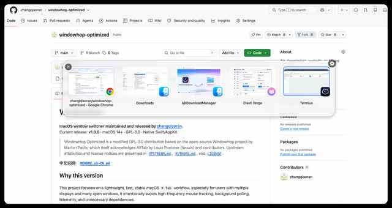
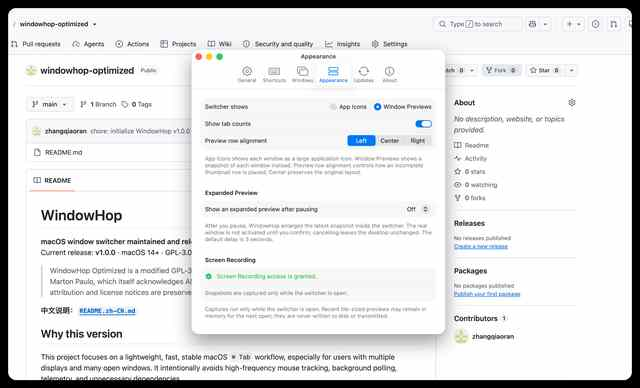

# WindowHop Optimized

**zhangqiaoran 维护的轻量 macOS 窗口切换器。**
当前版本：**v1.1.0** · macOS 14+ · 原生 Swift / AppKit · GPL-3.0

WindowHop Optimized 从现在开始以 **zhangqiaoran** 作为当前项目作者、维护者和发行者。v1.0.0 作为正式基线冻结；v1.1.0 在不堆功能、不增加后台轮询、不增加新运行时依赖的前提下，继续优化性能、内存、稳定性和 UI。

> 继承代码所需的 GPL-3.0 上游版权/来源信息单独保留在 [`UPSTREAM.md`](UPSTREAM.md) 和 [`LICENSE`](LICENSE) 中。

## v1.1.0：性能 + 轻量 UI

### 性能算法

| 场景 | v1.1 做法 | 收益 |
|---|---|---|
| 切换选中窗口 | **O(1) 更新旧/新两个 Tile** | 连续按 Tab / 方向键不再遍历所有可见缩略图 |
| Window ID 定位 | **Hash 索引** | 平均接近 O(1) |
| 缩略图匹配 | **PID 分桶 + 扁平 Score Matrix + 稠密 Bool Mask** | 减少跨 App 无意义比较和 Set/Dictionary 分配 |
| 缩略图刷新 | **O(n) 优先级规划器，直接返回下标** | 去掉 ID→Request 临时字典回查 |
| 截图任务 | **Session in-flight 去重** | AX/窗口变化连续通知时，同一窗口不会重复抓图 |
| `CGEventTap` 热路径 | **128-bit key-up BitSet** | 常规键码不再经过 Set 哈希和分配 |
| 会话窗口同步 | **单次遍历 + 预分配 Hash 容器** | Chrome / IDEA / Finder 多窗口变化时减少临时对象 |
| 缩略图缓存 | **约 64 MiB 成本受控 LRU 思路** | 长时间运行不会因为历史缩略图无限涨内存 |
| Tile 复用 | **隐藏时主动释放 transient preview** | 被 LRU 淘汰的图片不会又被隐藏 Tile 强引用 |
| 放大预览 | **隐藏即释放大图** | 减少大尺寸截图驻留 |

这里不是为了“算法名字高级”而使用复杂结构。例如屏幕定位依旧是 O(屏幕数量) 的 point-in-rect；实际通常只有 1～4 块屏幕，比维护 R-Tree / QuadTree 更轻、更快、更稳定。

### UI 轻量化

v1.1 的 UI 方向不是增加特效，而是减少没有必要的绘制：

- 面板边距、Tile 间距和缩略图尺寸更紧凑；
- 加载占位改成**静态 Skeleton**，取消无限循环动画；
- 去掉每张缩略图的实时阴影，减少 compositor 合成；
- 选中/悬停只更新绘制，不再触发布局计算；
- 缩短缩略图淡入时间；
- 关闭按钮视觉尺寸更小，但仍保留 44×44 点击区域；
- 缩略图行仍支持 **左 / 中 / 右** 三种对齐。

## 多扩展屏逻辑

开启 **Focused multi-display mode** 后：

- 鼠标在哪块屏，切换面板就只显示在哪块屏；
- 缩略图候选仍然包含**所有扩展屏上的窗口**；
- 只在打开切换器时读取一次鼠标所在屏幕；
- 不增加持续 `mouseMoved` 监听，也不增加后台 Timer 轮询。

## 关闭窗口

- 缩略图关闭按钮：直接关闭当前窗口；
- Delete / Backspace：直接关闭当前窗口；
- WindowHop 自己不再二次确认“关闭窗口还是退出应用”；
- Finder 只关闭选中的 Finder 窗口；
- 如果目标 App 自己存在“文件未保存”提示，仍然尊重目标 App 的系统/原生确认，避免数据丢失。

## 实际效果图

### 多窗口切换



### Appearance / 缩略图排版



## 快捷键

| 快捷键 | 功能 |
|---|---|
| **⌘⇥** | 打开 / 向前切换 |
| **⇧⌘⇥** | 向后切换 |
| **松开 ⌘** | 激活当前窗口 |
| **← → ↑ ↓** | 导航 |
| **Return / Space** | 确认 |
| **Esc** | 取消 |
| **Delete / Backspace** | 直接关闭选中窗口 |
| **⌘,** | 设置 |

## 资源与隐私原则

- 原生 Swift / AppKit；
- ScreenCaptureKit 只允许出现在 PreviewProvider；
- 无遥测、无账号；
- v1.1 不新增运行时依赖；
- 不新增后台轮询；
- 窗口截图只存在内存，不写磁盘、不上传；
- 在 zhangqiaoran 自己的签名和 appcast 更新链建立之前，社区版自动更新保持关闭。

## 构建

```bash
git clone https://github.com/zhangqiaoran/windowhop-optimized.git my-alt-tab
cd my-alt-tab
chmod +x scripts/package-app.sh
./scripts/package-app.sh
```

输出：

```text
build/my-alt-tab.app
artifacts/my-alt-tab-1.1.0.zip
```

个人/社区构建不需要付费 Apple Developer 账号，脚本没有 Developer ID 时会自动使用 ad-hoc 签名。

## 版本线

- **v1.0.0**：zhangqiaoran 正式基线，多屏聚焦显示、全屏窗口候选、直接关闭、缩略图缓存、EventTap 自愈。
- **v1.1.0**：热路径算法、截图去重、内存释放、O(1) 选中绘制和轻量 UI/compositor 优化。

完整发行说明：[`RELEASE_NOTES_v1.1.0.md`](RELEASE_NOTES_v1.1.0.md)

## 项目信息

- 作者 / 维护者 / 发行者：**zhangqiaoran**
- 当前版本：**1.1.0**
- Bundle ID：`com.zhangqiaoran.myalttab`
- GitHub：`zhangqiaoran/windowhop-optimized`
- License：GNU GPL-3.0
